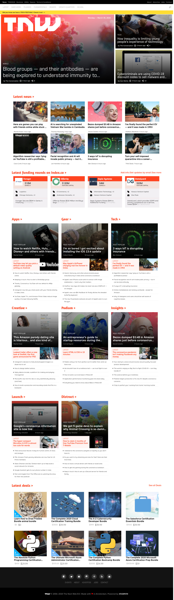

# The Odin Project: Building with Responsive Design

In this project, we build a responsive clone of The Next Web, a tech-focused magazine which uses media queries to gracefully degrade their site as the window size is reduced.

3 viewports available:

- Small (max-width: 768px)
- Medium (min-width: 768px and max-width: 1024px)
- Large (min-width: 1024px)

[Original version](http://thenextweb.com/)

## Built With

- Only HTML & CSS used
- Flexbox & Grid

## Live Demo

[Live Demo Link](https://marcoshdezcam.github.io/Building-with-Responsive-Design/)

## Authors

👤 **Marcos Hernández Campos**

- Github: [@marcoshdezcam](https://github.com/marcoshdezcam)
- Twitter: [@MarcosHCampos](https://twitter.com/MarcosHCampos)
- Linkedin: [Marcos Hernández](https://linkedin.com/marcos-hernández-56058119a/)

👤 **Jorge Cerón**

- Github: [@duducus](https://github.com/duducus)
- Twitter: [@jorgeceron](https://twitter.com/jorgeceron1)
- Linkedin: [linkedin](https://mx.linkedin.com/in/jorge-francisco-cer%C3%B3n-gil-343583113)

## 🤝 Contributing

Contributions, issues and feature requests are welcome!

Feel free to check the [issues page](issues/).

## Show your support

Give a ⭐️ if you like this project!

## 📝 License

This project doesn't require a license.
